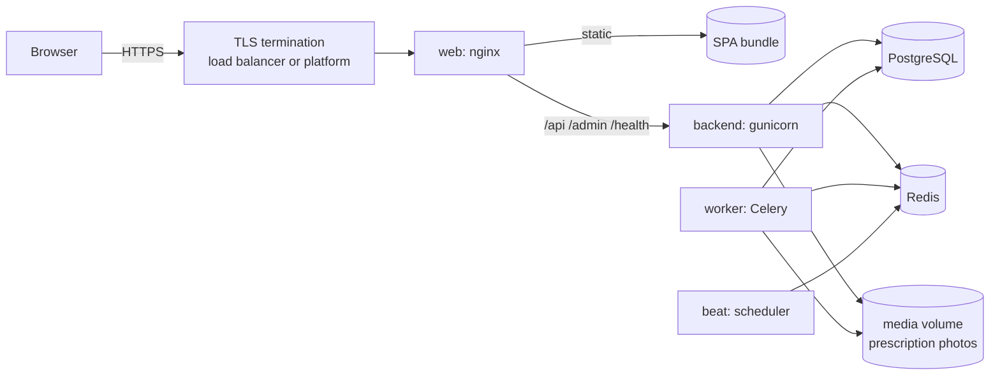

# Deployment

**Milestone 4 deliverable — deployment steps.**

For this submission, deploy **MUTHUKUMARAN-K-1/intern-07-muthukumaran-k**,
branch **`intern/07-muthukumaran-k`**. Both blueprints pin that branch.
The [current verification report](reports/branch-readiness.md) separates this
run's evidence from the reference implementation's historical container tests.

## Configure the complete account and notification workflows

- Set `FRONTEND_BASE_URL` to the public HTTPS web URL. Password-reset emails link
  to `/reset-password?uid=...&token=...` on this origin.
- Create a Google web OAuth client, allow the web app's JavaScript origin, and set
  the same ID in `GOOGLE_OAUTH2_CLIENT_ID` and `VITE_GOOGLE_CLIENT_ID`. The server
  verifies Google's ID token; this flow does not need a client secret.
- Configure a verified email sender and SendGrid or SMTP. Set the same email
  environment on API and worker, since password resets and scheduled reminders
  run in different processes.
- For browser push, configure Firebase Cloud Messaging and a web VAPID key. Set
  the six `VITE_FIREBASE_*` values shown in `frontend/.env.example` at **build time**.
  These are public web-app configuration. Never put the service-account private
  key in a `VITE_*` variable.
- Mount the Firebase service-account JSON read-only on **API and worker**, and set
  `FIREBASE_CREDENTIALS_PATH`. On Render, upload the same secret file to both
  services as `/etc/secrets/firebase-service-account.json`. For Compose, add a
  read-only host-file mount under `x-backend.volumes` alongside the media volume.
- Set the three `TWILIO_*` variables on API and worker for SMS. Users also need a
  valid phone number and an enabled SMS preference.
- Rebuild the frontend after changing public Google/Firebase values. On the
  Notifications page, enable browser reminders explicitly and grant permission.
  Test delivery with the app both open and closed, then sign out and verify the
  previous account's registration is inactive.

Without transport configuration, production notification attempts are logged as
failed, not as successful console deliveries. Development remains a simulated
demo. Delivery statistics measure provider acceptance, not end-device receipts.

This guide gets PillSync from a repository to a running, HTTPS-served
application. Read [What has and has not been done](#what-has-and-has-not-been-done)
first: it is precise about which paths were exercised and which are written from
the platform's documentation.

## What gets deployed

Six processes, from two images:

| Process | Image | Job | Scales by |
|---|---|---|---|
| **web** | `pillsync-frontend` (nginx) | Serves the built SPA; proxies `/api`, `/admin`, `/static`, `/health` to the API | more replicas |
| **backend** | `pillsync-backend` (gunicorn) | The Django REST API. Migrates the database and loads the medicine catalogue on start | `WEB_CONCURRENCY`, more replicas |
| **worker** | `pillsync-backend` | Celery: sends reminders, sweeps missed doses, generates doses, raises refill alerts | more workers |
| **beat** | `pillsync-backend` | Celery beat: the scheduler. **Exactly one** | never — one instance only |
| **db** | PostgreSQL 16 | All data | managed service, vertical |
| **redis** | Redis 7 | Celery broker and results | managed service |

The backend image contains Tesseract, so OCR runs in-process with no extra service.

Only nginx is exposed. Postgres and Redis are on the internal network.



## The two things every deployment needs

1. **TLS in front of everything.** The app assumes HTTPS: it redirects http to
   https, sets HSTS, and marks cookies secure. Your load balancer or platform
   terminates TLS and forwards `X-Forwarded-Proto: https`. (Render, App Runner,
   Container Apps and every managed load balancer do this by default.)
2. **Real secrets, set in the platform — never in the repository.** `SECRET_KEY`,
   the database password, and any provider keys. `.env.*` is git-ignored and CI
   scans every push for credentials.

The production settings **refuse to start** if `SECRET_KEY` is missing or looks
like the development default, if `ALLOWED_HOSTS` is empty, or if the database is
SQLite, or if `CACHE_URL` is missing. A misconfigured deployment fails at boot.

---

## Option 1 — One machine with Docker Compose  *(tested)*

Suits a demo, a pilot, or a single small server. This is the topology the
smoke test and the load test in [`docs/reports/`](reports/) ran against.

```bash
cp .env.prod.example .env.prod
# edit .env.prod: set SECRET_KEY, POSTGRES_PASSWORD, ALLOWED_HOSTS
docker compose -f docker-compose.prod.yml --env-file .env.prod up -d --build --wait
python scripts/smoke_test.py http://localhost        # or the port in WEB_PORT
```

Generate a secret with `python -c "import secrets; print(secrets.token_urlsafe(50))"`.

Put a TLS-terminating proxy (Caddy, a cloud load balancer) in front of port 80.
To try the stack on a laptop over plain http, set `USE_HTTPS=false` — and only
there.

**Updating:** `git pull && docker compose -f docker-compose.prod.yml --env-file .env.prod up -d --build`.
The backend applies migrations on start. Database and uploaded photos live in the
`pgdata` and `media` volumes and survive rebuilds.

**Logs:** `docker compose -f docker-compose.prod.yml logs -f backend worker`.

**Backups:** `docker compose -f docker-compose.prod.yml exec db pg_dump -U pillsync pillsync > backup.sql`,
and copy the `media` volume. Restore is the reverse. Test a restore before you
need one.

---

## Option 2 — Render  *(blueprint written; not deployed)*

[`render.yaml`](../render.yaml) describes the whole stack. It has not been
applied to a Render account: that needs an account and payment method that belong
to a person, not to this repository.

1. Connect this fork to Render and select `intern/07-muthukumaran-k`.
2. **New → Blueprint**, choose this repository and branch. Render reads `render.yaml` and
   proposes: a Postgres database, a Redis-compatible key-value store, the API, a
   background worker, and the static web app.
3. Review the services, confirm. Render builds the backend image from
   `backend/Dockerfile` (the production stage is the default) and the SPA with
   `npm ci && npm run build`.
4. When the API is live, open its **Environment** tab and check:
   - `ALLOWED_HOSTS` is the API's real hostname (change it if you renamed the
     service or added a custom domain).
   - `CORS_ALLOWED_ORIGINS` is the web app's URL.
   - Add `SENDGRID_API_KEY` (or the `EMAIL_*` variables) to send real email.
5. Set the `destination` of the `/api/*` and `/admin/*` rewrites in the web app
   (`render.yaml` → `routes`) to the API's URL if it differs from
   `pillsync-api.onrender.com`.
6. Update all `/api/*`, `/admin/*`, `/static/*` and `/health/*` rewrites if the API
   hostname changes. Set `FRONTEND_BASE_URL`, the verified sender and provider
   variables on API and worker. Keep `OCR_ASYNC=false`: Render's API disk is not
   shared with its worker, so image OCR must run on the API.
7. Open the web app's URL, register, and run `scripts/smoke_test.py` against staging.
   Check Google sign-in, reset links, real device delivery and scheduled jobs.

Things to know about Render:

- **Cost.** The blueprint uses paid plans on purpose: a database that expires
  after 30 days, or a service that sleeps after inactivity, cannot be relied on
  to deliver reminders. Check Render's current pricing before applying.
- **Media.** The API service mounts a 1 GB disk for prescription photos (paid
  feature). Without it, photos vanish on each deploy; OCR still works and the
  extracted text is kept, but the "view original photo" link would 404.
- **One worker with beat embedded** (`celery -B`). Fine for one worker. Before
  adding a second, run beat as its own service or every schedule fires twice.

---

## Option 2b — Free: Render + a free database + a free cron  *(demo only; not deployed)*

For showing the project, not for real patients. [`render.free.yaml`](../render.free.yaml) is the
blueprint. Free tiers change, so confirm each provider's current limits before relying on them.

**What you give up**

| Free-tier limit | Effect |
|---|---|
| No free background worker | Reminders are sent by an outside cron calling the API (below) instead of Celery |
| The free Render database has expired after 30 days | Use a free Postgres that does not (Neon or Supabase) |
| Free web services sleep when idle | The first request after a quiet spell takes about a minute. The 5-minute cron below also keeps it awake |
| No disk | Uploaded prescription photos are lost on each deploy; OCR still works |
| About 512 MB of memory | `WEB_CONCURRENCY=1`; a very large photo may fail |
| Reminders reach the console, not phones | Until you add SendGrid / Firebase / Twilio credentials |

**Steps**

1. Create a free Postgres on [Neon](https://neon.tech) (or Supabase). Copy its connection string
   (a `postgresql://` URL ending in `?sslmode=require`).
2. In Render choose **New → Blueprint**, pick the repository, and set the blueprint file path to
   `render.free.yaml`. When asked for `DATABASE_URL`, paste the string from step 1.
3. Apply. Two services are created: `pillsync-api` (Docker, free) and `pillsync-web` (static site).
   If a name is taken, rename it in the file and update `ALLOWED_HOSTS`, `CORS_ALLOWED_ORIGINS` and
   both rewrite `destination` lines to match.
4. When the API is live, check `https://<api>.onrender.com/health/ready/` returns `ok`, then open the
   web app, register, and run `python scripts/smoke_test.py https://<web>.onrender.com`.
5. Copy `CRON_SECRET` from the API service's **Environment** tab.
6. On a free cron service such as [cron-job.org](https://cron-job.org), create two jobs, each an HTTP
   **POST** with the header `X-Cron-Secret: <the secret>`:

   | URL | Schedule | Does |
   |---|---|---|
   | `https://<api>.onrender.com/internal/run-jobs/?group=frequent` | every 5 minutes | Sends due reminders; marks unanswered doses missed |
   | `https://<api>.onrender.com/internal/run-jobs/?group=daily` | once a day | Generates upcoming doses, refreshes refill forecasts, warns of expiring prescriptions, deletes stale scans |

   Reminders can be up to five minutes late, because that is how often the cron calls.
7. Create an admin login with `python manage.py createsuperuser` against the same database, from your own
   machine: `DATABASE_URL=<neon string> DJANGO_SETTINGS_MODULE=config.settings.prod SECRET_KEY=x ALLOWED_HOSTS=x python manage.py createsuperuser`
   (Render's free tier has no shell).

The endpoint `POST /internal/run-jobs/` runs the same task functions Celery beat would. It answers 404
unless `CRON_SECRET` is set, and 403 for a wrong secret, so a deployment with a real worker exposes nothing.

---

## Option 3 — AWS  *(reference architecture; not deployed)*

| Component | AWS service | Notes |
|---|---|---|
| Web + API containers | **ECS on Fargate** behind an **Application Load Balancer** (or App Runner for the API alone) | Push both images to **ECR**. ALB terminates TLS with an **ACM** certificate |
| Database | **RDS for PostgreSQL 16**, Multi-AZ | Private subnets; security group allows only the app tasks |
| Redis | **ElastiCache for Redis** | Private subnet |
| Worker, beat | Two more Fargate services from the backend image, with `command` overridden | Beat desired count = 1, always |
| Photos | **S3** bucket | Needs `django-storages`; see the note below |
| Secrets | **Secrets Manager** / SSM Parameter Store, injected as task environment | Never bake them into the image |
| DNS, TLS | **Route 53** + **ACM** | |
| Logs, alarms | **CloudWatch** | Alarm on ALB 5xx and on `/health/ready/` failures |

Outline:

1. Create a VPC with public subnets (ALB) and private subnets (tasks, RDS, Redis).
2. Build and push the images: `docker build -t <acct>.dkr.ecr.<region>.amazonaws.com/pillsync-backend backend`
   (and `frontend`), then `docker push`.
3. Create RDS and ElastiCache; note their endpoints.
4. Define task definitions: the backend with `RUN_MIGRATIONS=true` and its
   health check on `/health/ready/`; the worker and beat with their `command`
   overridden and **without** `RUN_MIGRATIONS`.
5. Create the ALB with a target group on the web service, listener 443 → web,
   redirect 80 → 443. The nginx container already proxies `/api` to the backend
   service; give the backend a service-discovery name `backend`, or change
   `proxy_pass` in `frontend/nginx.conf`.
6. Set the environment from the [variable reference](#environment-variables).

**Media on S3.** The application stores photos through Django's file storage. On
containers with ephemeral disks, use S3: add `django-storages[s3]` and set
`STORAGES["default"]` to `storages.backends.s3.S3Storage` with a private bucket.
Photos are served through the authenticated `/ocr/jobs/{id}/image/` endpoint, so
the bucket must stay private. This change is not made in the repository.

## Option 4 — Azure  *(reference architecture; not deployed)*

| Component | Azure service |
|---|---|
| API, worker, beat, web | **Azure Container Apps** (one app per process; beat with min = max = 1 replica), images in **Azure Container Registry** |
| Database | **Azure Database for PostgreSQL – Flexible Server** |
| Redis | **Azure Cache for Redis** |
| Photos | **Blob Storage** (`django-storages[azure]`) |
| TLS, domain | Container Apps managed certificate or **Front Door** |
| Secrets | **Key Vault** referenced from Container Apps secrets |
| Logs | **Log Analytics** |

The steps mirror AWS: push images to the registry, create the database and cache,
create the container apps with the same commands and environment, point the
ingress at the web app. The SPA can alternatively be hosted on **Static Web
Apps**, with `/api/*` routed to the API container app.

## Frontend on Vercel or Netlify  *(optional)*

The SPA is static. Build with `npm run build`, publish `frontend/dist`, and route
`/api/*` and `/admin/*` to the API (a rewrite rule), so the browser sees one
origin. If the API is on a different origin, set `CORS_ALLOWED_ORIGINS` and
`CSRF_TRUSTED_ORIGINS` on the API and `VITE_API_BASE_URL` at build time.

---

## Environment variables

Required, with no default:

| Variable | Meaning |
|---|---|
| `SECRET_KEY` | Django signing key. Long, random, unique per environment |
| `ALLOWED_HOSTS` | Comma-separated host names the site answers to |
| `DATABASE_URL` **or** `POSTGRES_HOST`, `POSTGRES_PASSWORD` (+ `POSTGRES_DB`, `POSTGRES_USER`, `POSTGRES_PORT`) | PostgreSQL |
| `CELERY_BROKER_URL`, `CELERY_RESULT_BACKEND` | Redis URLs |
| `CACHE_URL` | Shared Redis rate-limit cache; Compose supplies database 2 |

Optional:

| Variable | Default | Meaning |
|---|---|---|
| `USE_HTTPS` | `true` | Redirect to https, HSTS, secure cookies. `false` only for a local smoke test |
| `CORS_ALLOWED_ORIGINS`, `CSRF_TRUSTED_ORIGINS` | empty | Needed only when the SPA is on another origin |
| `WEB_CONCURRENCY` | `3` | gunicorn workers |
| `RUN_MIGRATIONS` | `false` | `true` on the **web** container only; runs `migrate` and seeds the catalogue |
| `SEED_REFERENCE_DATA` | `true` | With `RUN_MIGRATIONS`, load the medicine catalogue if needed |
| `SENDGRID_API_KEY` | — | Real email through SendGrid. Or set `EMAIL_HOST`, `EMAIL_PORT`, `EMAIL_HOST_USER`, `EMAIL_HOST_PASSWORD`, `EMAIL_USE_TLS` |
| `DEFAULT_FROM_EMAIL` | `noreply@pillsync.local` | Sender address |
| `FIREBASE_CREDENTIALS_PATH` | — | Push notifications (FCM) |
| `TWILIO_ACCOUNT_SID`, `TWILIO_AUTH_TOKEN`, `TWILIO_FROM_NUMBER` | — | SMS |
| `GOOGLE_OAUTH2_CLIENT_ID`, `VITE_GOOGLE_CLIENT_ID` | — | Matching Google ID-token sign-in client IDs |
| `FRONTEND_BASE_URL` | local development origin | Public HTTPS origin for reset links |
| `VITE_FIREBASE_*` | — | Public web configuration and VAPID key; see frontend template |
| `NOTIFICATION_MAX_ATTEMPTS` | `3` | Bounded retry attempts, with exponential minute backoff |
| `OCR_ENGINE` | Tesseract | Dotted path of an OCR engine class |
| `OCR_ASYNC` | `false` | Queue scans on Celery instead of reading inline. Turn on once a worker runs |
| `OCR_RETENTION_DAYS` | `30` | Unconfirmed scans and their images are deleted after this |
| `MAX_UPLOAD_SIZE_BYTES` | `10485760` | Largest accepted photo |
| `REFILL_LEAD_TIME_DAYS` | `5` | How many days before running out the refill warning starts |
| `THROTTLE_USER_RATE` | `5000/day` | Per-user API rate limit |
| `CRON_SECRET` | — | Enables `POST /internal/run-jobs/` for hosts with no Celery worker. Unset = endpoint disabled |
| `SLOW_REQUEST_MS` | `500` | Requests slower than this are logged |
| `TIME_ZONE`, `LOG_LEVEL` | `UTC`, `INFO` | |
| `JWT_ACCESS_TOKEN_LIFETIME_MINUTES`, `JWT_REFRESH_TOKEN_LIFETIME_DAYS` | `30`, `7` | Token lifetimes |

## Health, monitoring and operations

- **`GET /health/`** — liveness: the process is up.
- **`GET /health/ready/`** — readiness: database and shared cache answer. Use this for load
  balancer and container health checks; it takes an instance out of rotation when
  it loses the database.
- Every response carries a **`Server-Timing`** header, and requests slower than
  `SLOW_REQUEST_MS` are logged with their route.
- **Administrators** see latency percentiles and platform metrics in the app
  (Platform analytics), from `GET /api/v1/analytics/admin/` and `/performance/`.
  Latency is kept in memory per process; for real monitoring, scrape logs or add
  an APM (the `Server-Timing` header carries what one needs).
- **Nightly jobs** (Celery beat): dose generation 02:00, scan cleanup 03:30,
  refill forecasts 06:00, prescription expiry 08:00; missed-dose sweep every 15
  minutes, reminder dispatch and failed-delivery recovery every minute.
- **Rollback:** redeploy the previous image tag. Migrations in this release only
  add tables and columns; none removes or rewrites data, so rolling the code back
  leaves a compatible database.

## Verifying a deployment

```bash
python scripts/smoke_test.py https://your-domain
```

Twenty checks, from outside: the app is served; liveness and readiness; anonymous
requests are refused; the admin is reachable; an account can be registered and
logged into; a typed prescription is parsed, matched and confirmed into reminders;
an **image upload passes the proxy and is read by the real OCR engine**; the
forecast, adherence and dashboard endpoints answer. It creates one throwaway
patient, so run it against staging, not against production data. CI runs it on
every push against the full stack.

## What has and has not been done

**Done and tested:**

The container and load-test claims below describe the inherited reference build.
This fork was re-tested with 831 automated tests; its updated container topology
is checked by CI because Docker was unavailable locally. See the current report.
- Both images build; the production image is what a plain `docker build` gives.
- The full production topology (Postgres, Redis, gunicorn, nginx, Celery worker
  and beat) runs from `docker-compose.prod.yml`. The smoke test passes 20/20
  against it, and CI runs it on every push.
- The load test and figures in [`reports/performance.md`](reports/performance.md)
  are from this topology.
- The production settings' refusals (missing secret, empty hosts, SQLite) and its
  mail and HTTPS switches are covered by tests.

**Written from documentation, not exercised:**
- `render.yaml`, `render.free.yaml` (the cron endpoint behind it is tested), and the AWS and Azure sections. No cloud account was used, so
  there is **no live URL**. Expect to adjust names, plan sizes and regions.
- Real delivery of push, SMS and email. Development simulates absent providers;
  production records missing transports as failures. Actual delivery to a phone
  or inbox is not.
- Photos on object storage (S3 / Blob): described above, not implemented.
