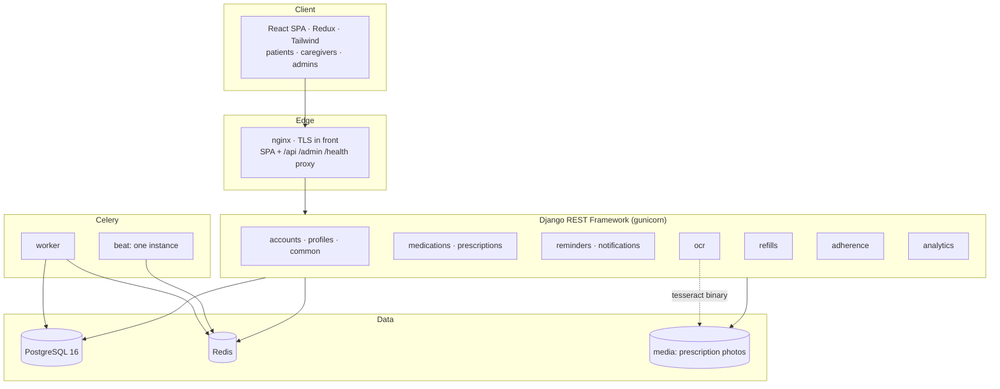

# PillSync — final project report

**Intelligent Medicine Reminder and Medication Tracking Platform**

For this fork, the [branch readiness report](branch-readiness.md) and
[testing report](testing-report.md) are the current evidence: **831 tests pass**.
The narrative and historical measurements below originated in the reference
implementation at `f4e9167`. This branch completes account UI, browser push,
persistent notification retries and production deployment configuration.
Cloud hosting and real provider delivery remain release acceptance steps.

## 1. Summary

PillSync helps people take the right medicine at the right time, and tells them
before it runs out. A patient — or a family member managing several profiles —
records medicines with dose times; the platform reminds them, records what they
did about each dose, works out how consistently they are taking it, predicts when
each medicine will run out, and warns them (and the caregiver who does the
pharmacy run) in time. A photograph of a prescription can fill in the medicines
for them to check.

It is a Django REST API with a Celery scheduler, a React single-page app, and
PostgreSQL and Redis behind them, delivered as two container images. Four
milestones built it up in order:

| Milestone | Delivered |
|---|---|
| 1 — Requirements, database, core setup | Accounts with JWT and Google sign-in, three roles (patient, caregiver, admin) with role-based access, patient and family profiles, caregiver invitation and consent, the FDA-derived medicine catalogue (3,111 presentations, 833 generics), CI/CD, documentation |
| 2 — Medication management and reminders | Medicines with stock, dosage schedules (daily, chosen days, every N days), reminders with Taken / Missed / Snooze / Skip, an overdue sweep, notification workflows (push, email, SMS) with delivery logging, medication history |
| 3 — OCR and refill prediction | Prescription scanning with human review, refill prediction from real dose history, stock ledger, refill and low-stock alerts including caregivers, adherence analytics |
| 4 — Analytics, testing, deployment | Patient, caregiver and administrator dashboards, refill and adherence visualisations, API performance metrics, production packaging and smoke test, performance and testing reports |

## 2. What the specification asked for, and where it stands

| Requirement | Status |
|---|---|
| Authentication, roles, profiles, families, caregivers | Done (M1) |
| Medicine management, disease-based organisation | Done (M2) |
| Dosage scheduling, reminders, Taken / Missed / Snooze | Done (M2) |
| Push, email and SMS notification workflows | Built and tested; **real delivery untried** — development simulates delivery; production missing transports fail visibly |
| Multiple patient profiles, caregiver alerts | Done (M1–M3) |
| Prescription OCR with extraction of name, dosage, quantity, frequency, details | Done (M3): Tesseract, rule-based parser, catalogue matching, human review |
| Manual entry as an alternative | Done — paste or type the text and take the same review path; the medicine form remains |
| AI refill prediction from quantity, frequency, dose, missed doses, manual updates | Done (M3): schedule blended with observed use; stock ledger for manual updates |
| Refill and low-stock notifications, caregiver notifications | Done (M3) |
| Adherence analytics: daily history, percentage, trends | Done (M3) |
| Dashboards; refill and adherence visualisations | Done (M4) |
| Testing and validation | 831 automated tests passed locally; 20 deployment checks configured in CI |
| Cloud deployment | **Not done.** Packaged, verified as a running stack, written up for Render, AWS and Azure — but no live host, because that needs an account that belongs to a person |
| Final documentation and presentation | Done; no video recorded |
| spaCy or OpenAI for parsing | **Not used**, deliberately (see 4.1) |

## 3. Architecture



- **Reminder pipeline.** A schedule is a rule; a `DoseEvent` is one dated instance,
  created 14 days ahead. That one row is the reminder, the medication-history
  record and — in Milestone 3 — the adherence count. See
  [`reminder-pipeline.md`](../architecture/reminder-pipeline.md).
- **OCR, refills and analytics** are described in
  [`ocr-and-refills.md`](../architecture/ocr-and-refills.md).
- **Data model:** [`schema.md`](../database/schema.md). **API:** [`openapi.yaml`](../api/openapi.yaml)
  and [`README.md`](../api/README.md). **Deployment:** [`deployment.md`](../deployment.md).

## 4. Decisions worth defending

**4.1 Rules, not a language model, for reading prescriptions.** Prescription
shorthand is a small closed vocabulary; rules handle it exactly, deterministically
and offline, so a scan of a medical record never leaves the server, and a wrong
answer can be traced to a line of code. The cost is that an unfamiliar style scores
lower — which is why the patient always reviews the result. An LLM is the next
step for free text; the pipeline's shape would not change.

**4.2 Uncertain means suggest, never apply.** The recurring failure in a
medication app is a confident wrong answer. So a doubtful catalogue match is only
suggested; a poorly read page downgrades *every* match to a suggestion; nothing is
saved until the patient confirms; and assumptions are printed ("written as once
daily with no time, so morning was assumed").

**4.3 Blend the schedule with reality.** The prescribed schedule is right on day
one and wrong for anyone who misses doses; observed behaviour is right once there
is history and noisy without it. The forecast weights them by how much history
exists. On simulated patients this cut the run-out date error from 8.9 to 5.3 days.

**4.4 One row is the reminder, the history and the adherence count.** It removed a
whole class of drift between "what we reminded" and "what happened", and meant
adherence needed no new table.

**4.5 Skipped is not missed.** A dose the doctor told the patient to stop is not
an adherence failure. Counting it either way would make every percentage lie.

**4.6 A ledger for stock.** Every change other than a dose — the starting count, a
refill, a manual "I counted 12" — is recorded, so a forecast that suddenly moved can
be explained, and a bare PATCH of the stock figure is refused.

**4.7 Hand-drawn SVG charts.** Four chart types and about 300 lines, rather than a
charting library: the whole app is 131 kB gzipped, every chart has a text
alternative, and no-data is drawn as "no data", never as zero.

**4.8 Deactivate, never delete.** Stopping a medicine, archiving a prescription and
deactivating a user keep the history that adherence and audits depend on.

## 5. Results

Measured, with method and caveats, in [`performance.md`](performance.md):

| | |
|---|---|
| API latency, one client | median 33 ms, p95 61 ms |
| Dashboard | median 43 ms |
| Load | 100 continuously-active clients, 0 errors; ~80 req/s on 2 workers, ~180 on 6 |
| Adherence calculation | 300/300 random histories match an independent calculation |
| Missed-dose detection | precision 100%, recall 100% |
| Refill run-out date (simulated) | 5.3 days mean error; 78% within ±5 days |
| Low-stock warning (simulated) | 100% warned in time, median 6 days' notice |
| OCR, clean rendered text | 100% of fields; degraded image finds 22.5% of medicines, and matches are then suggested, never applied |
| Backend coverage | 89.7% |

The prediction and OCR figures are on synthetic data and show that the methods
work and how the alternatives rank. They are **not** the accuracy real patients and
real photographs would give.

## 6. What went wrong, and what it taught

This is the section to read if you take over the project.

1. **The deployed system was broken and no test said so.** The production password
   hasher was configured but not installed; every registration would have returned a
   500. Development and CI used a different hasher. Found only by smoke-testing the
   real container stack, which now runs in CI.
2. **A parser bug silently produced medicines with no reminders** for one prescribing
   style in six ("500mg tablet twice daily"). Unit tests were green because they had
   been written from the same assumptions as the code. Found by measuring accuracy on
   generated prescriptions the parser had not been tuned on.
3. **My first load test was wrong in a flattering way.** A per-user rate limit
   answered most requests with instant `429`s, and the script counted only 5xx as
   errors, so it reported "0% errors" and a server several times faster than reality.
   The whole run was discarded. Read the status codes before the latencies.
4. **Tests that depended on the time of day.** Ten tests (eight from Milestone 2)
   failed for most of the day on a UTC server, because they assumed a fixed 08:00, or
   that "five minutes from now" is still today. A sweep that ran the suite with the
   clock fixed at every hour, and at the minutes around midnight, found them; they now
   pin "now". They would have failed CI for any push between 09:00 and midnight UTC; it went unnoticed because every Milestone 2 run on `main` happened before 08:00 UTC.
5. **Two slow queries hid behind small data.** The dashboard was six times slower
   than necessary and administrator analytics issued 1,400 queries. Both were invisible
   until the database had a few hundred users; a query-count test now guards the latter.
6. **A wrong drug could be matched automatically** on a badly read page. The fix was a
   rule: a poor read means suggest, never apply.

## 7. Limitations and risks

- **Partial cloud deployment.** The completed branch's frontend is live on Render;
  the API, scheduled jobs and live acceptance remain pending. See
  [deployment progress](../deployment.md#no-card-deployment-progress--2-october-2026).
- **No real notification delivery** has been tried; a reminder that does not reach a
  phone defeats the product. This is the first thing to test with real credentials.
- **Handwriting** is unsupported, and it is common. **Real phone photographs** have
  not been measured — only rendered text.
- **Prediction accuracy is unproven on real people.** Patients whose habits are
  changing are forecast late (about 13 days' error).
- **Medical-safety scope.** PillSync reminds and tracks; it does not check drug
  interactions, doses against patient weight, or allergies, and is not a medical
  device. Its warnings assume the patient records doses faithfully.
- **Photos on local disk**, so a multi-instance deployment needs object storage first.
- **Reports bucket by the server's day**, not the patient's, across timezones.
- **Browser coverage is limited.** Four Chromium workflows pass, including an
  emulated mobile viewport; no expert accessibility audit or physical-device
  acceptance has been performed.
- Privacy: prescription photos are medical records. They are served only through an
  authenticated endpoint, kept 30 days if never confirmed, and never logged; but no
  formal privacy review or compliance assessment (HIPAA, GDPR) has been done.

## 8. Recommended next steps

1. Finish the staging API/database connection and run the smoke test against it.
2. Configure real push/email credentials and measure actual delivery.
3. Collect consented, real dose data; re-run the refill evaluation on it and add a
   trend term.
4. Add a hosted OCR engine behind the existing seam for handwriting; evaluate on
   real photographs.
5. Move photos to object storage; extend browser/device coverage and run an accessibility audit.
6. Get a privacy and clinical-safety review before any real patient uses it.

## 9. Reproducing this work

```bash
python backend/scripts/run_demo.py                     # API + demo data on :8010
cd frontend && npm run dev:demo                        # the app on :5173
docker compose -f docker-compose.prod.yml --env-file .env.prod up -d --build
python scripts/smoke_test.py http://localhost:8088     # 20 checks
python ml/src/refill_prediction/evaluate.py            # refill backtest
docker run ... python ml/src/ocr/evaluate.py           # OCR evaluation (needs Tesseract)
```
